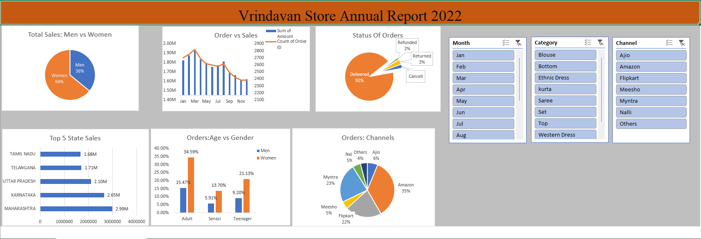

# Vrinda Store Sales Analysis Dashboard (Excel)

## 📌 Project Overview

This project is an interactive Excel dashboard created using the Vrinda Store sales dataset. The dashboard analyzes customer behavior, sales performance, order status, sales channels, and regional sales trends to generate business insights.

The goal is to help stakeholders understand sales patterns and make data-driven decisions to improve revenue and customer engagement.

---

##  Dashboard Preview

---

##  Key Insights

### Gender-wise Sales
- Women contribute approximately **64%** of total sales.
- Men contribute approximately **36%** of total sales.

### Top Performing States
- Maharashtra
- Karnataka
- Uttar Pradesh
- Telangana
- Tamil Nadu

### Age Group Analysis
- Adult customers (30–49 years) contribute the highest sales.
- Adult women are the largest customer segment.

### Order Status
- Delivered Orders: **92%**
- Returned Orders: **3%**
- Refunded Orders: **2%**
- Cancelled Orders: Remaining percentage

### Sales Channels
Major sales contribution comes from:
- Amazon
- Myntra
- Flipkart

Together, these platforms account for nearly **80%** of total sales.

---

##  Business Recommendations

To improve future sales:

- Focus marketing campaigns on **women customers**.
- Target the **30–49 years** age group.
- Increase promotions in **Maharashtra, Karnataka, and Uttar Pradesh**.
- Offer discounts and campaigns through **Amazon, Myntra, and Flipkart**.

---

##  Tools Used

- Microsoft Excel
- Pivot Tables
- Pivot Charts
- Slicers
- Data Cleaning
- Data Analysis
- Dashboard Design

---

##  Dashboard Features

- Interactive slicers for filtering data
- Gender-wise sales analysis
- State-wise sales performance
- Order status tracking
- Age vs Gender analysis
- Sales channel contribution analysis
- Monthly orders and sales trends

---

##  Files Included

- `Vrinda Store Data Analysis.xlsx` – Interactive Excel Dashboard
- `Vrinda_Annual_Report.xlsx` – Raw Dataset
- `README.md` – Project Documentation

---

##  Skills Demonstrated

- Data Analysis
- Data Visualization
- Business Intelligence
- Excel Dashboarding
- Reporting and Insights Generation

---

##  Author

**Aryan Prajapati**

Electrical Engineering Student, MANIT Bhopal

GitHub: https://github.com/aryanprajapati05
